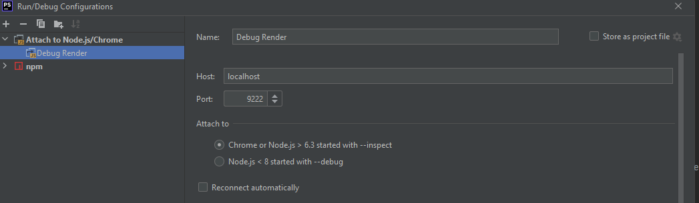

# This repo is only to demonstrate the steps need to convert an Electron Vite project to use TS instead of JS.
This project is still in a **very rough state** and there is a lot that I still want to do (mentioned some below in other) but didn't so that the PR can display a reasonable nice change list.
https://github.com/Deluze/electron-vue-template/issues/8

# Personal notes while refactoring

Okay can add the debug flag like this https://www.electronjs.org/docs/latest/api/command-line-switches in the electron code. 
Did not work when I specified --remote-debugging-port:9222 in dev-server.js here
`electronProcess = ChildProcess.spawn(Electron, args);` 

1. So npm run dev (not needed in debug mode, can do if want to debug the main process)
2. Then start the PHP Storm run config, attachment NodeJS debug process in debug mode (the only mode it can start) 


   
# How it works

Okay so for prod, then it runs vite with prod mode that uses rollup to create buncdled code. 

While in dev, uses vite in dev mode, it listens for source render changes and does the HMR without restarting the whole vite server, 
that electron uses. It restarts (by watching) the electron process itself only if the source main dir has changes.

-- 
## The TS mystery... 

So Vite works with TS files out of the box! Awesome https://vitejs.dev/guide/features.html#typescript 

Like ES Build it only transpiles and does not do checking. So to check typescript need to run `tsc` bit it won't check in
the .vue files. For checking to work, we have to use `vue-tsc` instead. It will then check normal TS files and find 
the TS script sections in the .vue files and check them.

The `tsconfig.json` is only there to be used my `vue-tsc`. The npm pre script(`"prebuild": "cd src/renderer && vue-tsc"`) 
ensures that `tsc-vue` is run before `build` to make sure we have no TS errors;

FYI the `vue-tsc` example project says to use as tsconfig.json
```json
{
    "compilerOptions": {
      "target": "esnext",
      "module": "esnext",
      "moduleResolution": "node",
      "importHelpers": true,
      "isolatedModules": true,
      "noEmit": true
    }
  }
```
But had to change `"isolatedModules": false,` as it was looking in the node_modules dir and then error-ing about something.
But But https://vitejs.dev/guide/features.html#typescript-compiler-options says it must be true.... 
Ahh open issue here for this: https://github.com/vitejs/vite/issues/5814 adding `skipLibCheck: true` works see my comment on the issue.

Looking at the vue-ts starter the tsconfig.json also had these extra compilerOptions. (find link on this page: https://vitejs.dev/guide/#trying-vite-online, atm it is https://vite.new/vue-ts )
```json
{
  "useDefineForClassFields": true,
  "jsx": "preserve",
  "sourceMap": true,
  "resolveJsonModule": true,
  "esModuleInterop": true,
  "lib": [
    "esnext",
    "dom"
  ],
  "composite": true
}
```
But with `composite` to true it does not build, set to `false` and it works, coz it somehow does incremental `tsc` builds
which is not supported by `vue-tsc` yet.


# Other 

All the TS must be transpiled to JS (scripts, main, render folders), using tsc now, but will use ES Build for the scripts and the main/main.ts files later. 

Move to GULP tasks for the scripts, maybe make the gulp task in JS, then transpile the functions used in for gulp task and import 
or look at TS Gulp, prob exists.

Left the vite.js config in JS, no need to make that TS, just coz it is used in the build and dev commands of Vite and would 
then need to transpile for both those commands before use, so just left it as JS, but it can also be TS.

Can move the tsconfig.json from main and scripts out. So that it is used by default if no other tsconfig file is found. 
That will mean the render process will use the tsconfig.json file in its directory which is custom as per above.

==============


# Electron Vue Template

A starter template that's bundled together with **VueJS 3.x**, **Electron 16.x**, **ViteJS** and **Electron Builder** 👌

## About

This project got inspired by [electron-vue](https://github.com/SimulatedGREG/electron-vue)

This template uses [ViteJS](https://vitejs.dev) for the development server providing HMR (Hot Reload) while developing your Electron app.\
Building the Electron application is done by [Electron Builder](https://www.electron.build/), making your application cross-platform and easily distributable, it also supports cross-platform compilation!

This template doesn't come with any unnecessary dependencies and is unopinionated, so you can start developing your Electron / Vue applications however you want.

## Getting started

Execute the following commands to start developing straight away:

```bash
git clone https://github.com/Deluze/electron-vue-template
cd electron-vue-template
npm install
npm run dev
```

That's all!

## Commands

```bash
npm run dev # starts application with hot reload
npm run build # builds application

# OR

npm run build:win # uses windows as build target
npm run build:mac # uses mac as build target
npm run build:linux # uses linux as build target
```

Optional configuration options can be found in the [Electron Builder CLI docs](https://www.electron.build/cli.html).

## Project Structure

```bash
- root
  - config/
    - vite.js # ViteJS configuration
    - electron-builder.json # Electron Builder configuration
  - scripts/ # all the scripts used to build or serve your application, change as you like.
  - src/
    - main/ # Main thread (Electron application source)
    - renderer/ # Renderer thread (VueJS application source)
```

## Using static files

If you have any files that you want to copy over to the app directory after installation, you will need to add those files in your `src/main/static` directory.

#### Referencing static files from your main process

```js
/* Assumes src/main/static/yourFile.txt exists */

const { app } = require('electron');
const FileSystem = require('fs');
const Path = require('path');

const path = Path.join(app.getAppPath(), 'static', 'yourFile.txt');
const contents = FileSystem.readFileSync(path);
```
